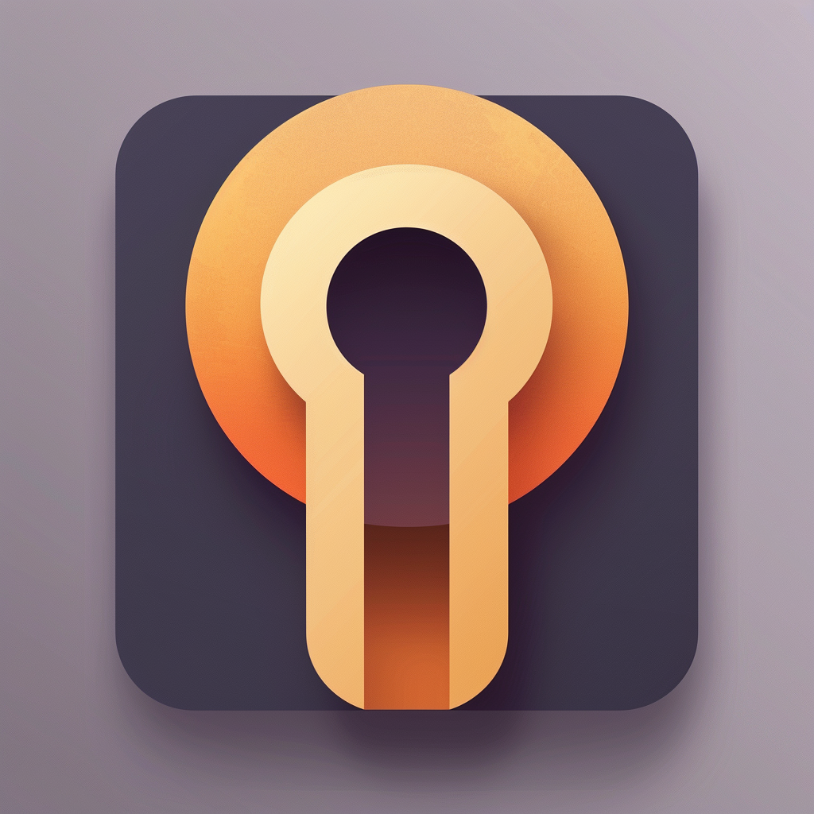
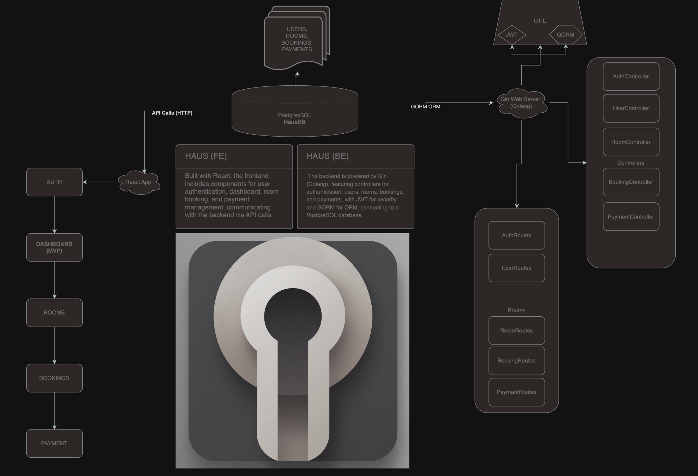

# HAUS

## Overview
HAUS is a revolutionary housing solution designed to address the diverse needs of individuals in New York City and beyond. With a focus on providing immediate shelter to those in desperate need, comfortable accommodations for travelers, and luxurious living experiences, HAUS offers a tiered housing system that caters to everyone. Through a unique membership system and the "Pay It Forward" program, HAUS fosters community support and resilience, especially in response to climate change and displacement.

## Tiers of Housing

### 1. LifeSaver Tier
Designed to provide immediate shelter and support for those in desperate need.
- **Basic Necessities:** Clean, safe, and secure housing with essential amenities.
- **Support Services:** Access to social services, counseling, and job placement programs.
- **Community Support:** Opportunities for residents to connect with support groups and community organizations.

### 2. Everyday Traveler Tier
For everyday people traveling for work or leisure who need a comfortable place to stay.
- **Comfortable Accommodations:** Well-furnished rooms with modern amenities.
- **Convenient Locations:** Properties near business districts, tourist attractions, and transportation hubs.
- **Flexible Stays:** Options for short-term and long-term stays with competitive pricing.

### 3. Luxe Tier
For those seeking a luxurious living experience.
- **High-End Amenities:** Premium furnishings, private balconies, rooftop access, and in-house fitness centers.
- **Exclusive Services:** Concierge services, private chefs, and housekeeping.
- **Prime Locations:** Properties in upscale neighborhoods with easy access to fine dining, shopping, and entertainment.

## Security Features

### LifeSaver Tier (Lowest Tier)
Designed to offer more freedom and build trust through responsible behavior.
1. **Digital Check-In and Check-Out**
   - QR Code Entry
   - Mobile App Integration

2. **Surveillance and Monitoring**
   - In-Unit Cameras
   - Motion Sensors

3. **Smart Locks**
   - App-Controlled Locks
   - Temporary Access Codes

4. **Emergency Alerts**
   - Panic Buttons
   - Automatic Alerts

5. **User Verification and Background Checks**
   - ID Verification
   - Background Checks

6. **Activity Logs**
   - Check-In/Out Logs
   - Access History

7. **Community Engagement**
   - User Ratings and Reviews
   - In-App Community Forums

8. **Periodic Inspections**
   - Routine Inspections
   - Maintenance Alerts

9. **Secure Communication Channels**
   - In-App Messaging
   - 24/7 Support

10. **Incentives for Responsible Use**
    - Reward System
    - Security Training

### Everyday Traveler Tier (Medium Tier)
Provides added security while ensuring comfort and convenience.
1. **Enhanced Digital Check-In**
   - Biometric Authentication
   - Advanced Mobile App Features

2. **Surveillance and Monitoring**
   - Enhanced Camera Systems
   - Real-Time Monitoring

3. **Advanced Smart Locks**
   - Biometric and App-Controlled Locks
   - Multi-Level Access Codes

4. **Comprehensive Emergency Systems**
   - In-Room Panic Buttons
   - Direct Line to Security Personnel

5. **Enhanced User Verification**
   - Multi-Factor Authentication
   - Detailed Background Checks

6. **Detailed Activity Logs**
   - Comprehensive Access History
   - User Behavior Analytics

7. **Community and Social Features**
   - Verified User Reviews
   - Enhanced Community Interaction

8. **Regular Maintenance and Inspections**
   - Frequent Inspections
   - Proactive Maintenance Alerts

9. **Premium Communication Channels**
   - Secure In-App Communication
   - Dedicated 24/7 Support

10. **Advanced Incentives for Proper Use**
    - Enhanced Reward System
    - Exclusive Security Workshops

### Luxe Tier (High Tier)
Combines top-tier security with luxurious living standards.
1. **Premium Digital Check-In**
   - Facial Recognition
   - Personalized Mobile App Experience

2. **High-End Surveillance and Monitoring**
   - Discreet High-Resolution Cameras
   - AI-Powered Monitoring Systems

3. **Luxury Smart Locks**
   - Facial and Fingerprint Recognition
   - Customizable Access Options

4. **Elite Emergency Systems**
   - Integrated Panic and Alert Systems
   - VIP Security Response

5. **Elite User Verification**
   - Comprehensive Multi-Factor Authentication
   - In-Depth Background Checks

6. **Premium Activity Logs**
   - Detailed Access and Behavior Logs
   - Advanced Security Analytics

7. **Exclusive Community Features**
   - Premium User Reviews
   - VIP Community Engagement

8. **Constant Maintenance and Inspections**
   - Continuous Inspections
   - Immediate Maintenance Response

9. **Elite Communication Channels**
   - Ultra-Secure In-App Messaging
   - Dedicated VIP Support

10. **Exclusive Incentives for Top Users**
    - Premium Reward System
    - Personalized Security Consultations

## Membership System
HAUS offers a unique membership system that encourages users to improve their living conditions over time, building a "housing credit" that unlocks higher-tier benefits.

### Membership Benefits:
- **Points Accumulation:** Earn points for each stay and through community involvement or referrals.
- **Tier Progression:** Move from the LifeSaver Tier to the Luxe Tier by accumulating points and maintaining a positive rental history.
- **Exclusive Discounts:** Enjoy discounts on stays, services, and amenities at higher tiers.
- **Priority Booking:** Get priority access to properties during peak seasons or high-demand periods.
- **Community Building:** Participate in community events and initiatives to earn additional points and enhance your membership status.

## Pay It Forward Program
HAUS incorporates a "Pay It Forward" program to enable members, especially those at higher tiers, to support others in need.

### Program Features:
- **Sponsor a Stay:** Members can sponsor stays for those in the LifeSaver Tier, providing them with immediate housing and support.
- **Upgrade Opportunities:** Members at higher tiers can contribute points or funds to help upgrade the accommodations of those in lower tiers.
- **Community Impact:** Members can choose to fund specific community initiatives or emergency relief efforts, especially in response to climate change and displacement crises.
- **Hosting and Volunteering:** Similar to Airbnb, members can host families or individuals, offering them temporary shelter and a chance to rebuild their lives.

## Implementation Plan

### 1. Backend Development
- **User Authentication:** Implement JWT authentication for secure user access.
- **Database Schema:** Create tables for Users, Memberships, Housing Tiers, Bookings, Points, and Sponsorships.
- **API Endpoints:** Develop endpoints for user registration, login, booking, point accumulation, tier progression, and sponsorships.

### 2. Frontend Development
- **User Interface:** Design a clean and user-friendly interface using React.
- **Dashboard:** Create a dashboard where users can view their membership status, points, available properties, and sponsorship opportunities.
- **Booking System:** Implement a seamless booking system with filtering options for different tiers.
- **Pay It Forward:** Add features for sponsoring stays, contributing points or funds, and participating in community initiatives.
- **Notifications:** Add notification features for booking confirmations, point updates, tier progression, and sponsorship opportunities.

### 3. Testing and Deployment
- **Testing:** Conduct unit, integration, and end-to-end testing to ensure the application works smoothly.
- **Deployment:** Deploy the application using Docker and set up CI/CD pipelines for continuous integration and deployment.

## Future Enhancements
- **Mobile App:** Develop a mobile application to make booking and membership management more convenient.
- **AI Recommendations:** Integrate AI to provide personalized property recommendations based on user preferences and history.
- **Partnerships:** Partner with local businesses and organizations to offer exclusive benefits to HAUS members.

By addressing the diverse needs of the NYC population and providing a pathway to improved living conditions, HAUS aims to make a significant positive impact on the community. The Pay It Forward program further enhances this mission by enabling members to support others, fostering a strong sense of community and resilience in the face of challenges such as climate change and displacement.
